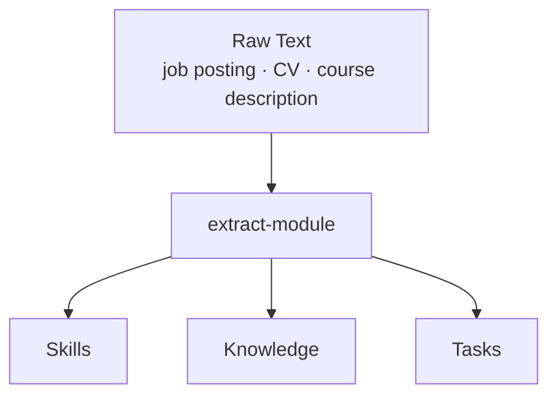
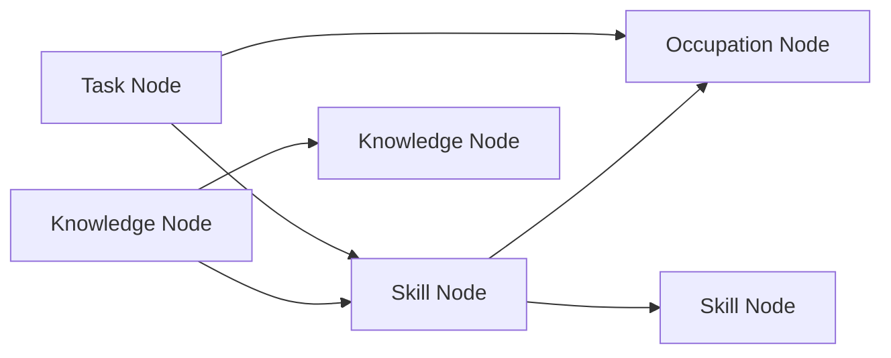
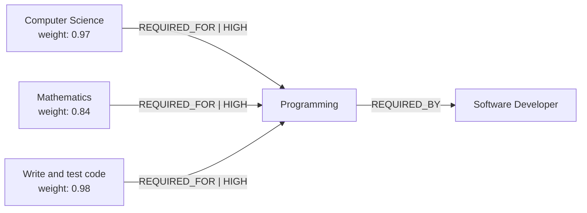
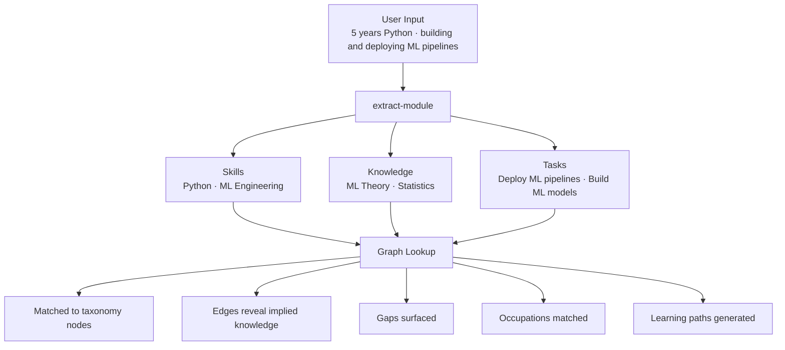

---

title: LAiSER v0.5 — Knowledge, Tasks & Graph Architecture

tags: [laiser, architecture, v0.5, graph, knowledge, tasks]

created: 2026-03-25

status: draft

---
# LAiSER v0.5 — Knowledge, Tasks & Graph Architecture

> [!quote] Our Definition

> **Knowledge + Tasks = Skill**

> A skill is not standalone. It is the product of knowing something and being able to act on it.

---

## What Completes the Extract Module

LAiSER's extract module currently pulls **Skills** from raw text. v0.5 extends this to extract all three pillars.

---

## Top Sources — Knowledge

> [!info] Why Academia for Knowledge?

> Knowledge is fundamentally academic. When a job posting says "requires knowledge of machine learning" it maps to a scientific concept, not an HR category. O*NET anchors it to the workforce. OpenAlex and Wikipedia give it depth.
  

| Rank | Source                          | Instances | Description Context                                            | HR / Corporate Relevance                                          | URL                                         | Free |
| ---- | ------------------------------- | --------- | -------------------------------------------------------------- | ----------------------------------------------------------------- | ------------------------------------------- | ---- |
| 1    | O*NET Knowledge + Level Anchors | ~3,300    | Name + definition + behavioral anchors at 7 proficiency levels | Very High — directly maps to job design and competency frameworks | onetcenter.org/database.html                | Yes  |
| 2    | ESCO Knowledge                  | ~3,000    | Name + definition + alt labels + broader/narrower concepts     | High — EU multinational job description design                    | esco.ec.europa.eu/en/use-esco/download      | Yes  |
| 3    | OpenAlex Topics                 | ~65,000   | Name + Wikipedia description + academic field + subfield       | Very Low — academic research, not HR                              | openalex.org                                | Yes  |
| 4    | Wikipedia via Hugging Face      | ~6.7M     | Full article text, deepest descriptions of any source          | Very Low — academic, filterable by category                       | huggingface.co/datasets/wikimedia/wikipedia | Yes  |
| 5    | ERIC Thesaurus                  | ~11,000   | Name + scope note + used-for + broader terms                   | Very Low — education research only                                | eric.ed.gov                                 | Yes  |
| 6    | MeSH                            | ~30,000   | Name + scope note + entry terms + tree hierarchy               | Very Low — biomedical only                                        | nlm.nih.gov/mesh/meshhome.html              | Yes  |

> [!note] Knowledge is ranked by academic depth and breadth, not HR relevance — that is intentional. Knowledge maps to academia. HR relevance is the role of Skills and Tasks.

---

## Top Sources — Task Abilities

| Rank | Source                               | Instances | Description Context                                             | HR / Corporate Relevance                                   | URL                                    | Free |
| ---- | ------------------------------------ | --------- | --------------------------------------------------------------- | ---------------------------------------------------------- | -------------------------------------- | ---- |
|      |                                      |           |                                                                 |                                                            |                                        |      |
| 1    | O*NET Tasks                          | ~19,000   | Task statement + occupation name + occupation description       | Very High — core US job description and benchmarking tool  | onetcenter.org/database.html           | Yes  |
| 2    | ESCO Occupation Tasks                | ~15,000   | Task statement + occupation title + sector                      | High — EU multinational job design                         | esco.ec.europa.eu/en/use-esco/download | Yes  |
| 3    | SOC Task Statements                  | ~10,000   | Task statement + occupation title + SOC description             | Very High — US labor market standard                       | bls.gov/soc                            | Yes  |
| 4    | O*NET Detailed Work Activities       | ~2,500    | Action-verb task statement + parent work activity category      | Very High — precise job descriptions and competency models | onetcenter.org/database.html           | Yes  |
| 5    | O*NET Abilities + Behavioral Anchors | ~52       | Name + definition + behavioral examples at 7 proficiency levels | High — structured hiring assessments                       | onetcenter.org/database.html           | Yes  |

> [!success] Combined Task Coverage

> ~57,000 task entries across all sources. Estimated **85–95% coverage** of real-world job market tasks.

---

## The Graph

### Node Types

| Node       | Key Properties                                            |
| ---------- | --------------------------------------------------------- |
| Skill      | name · description · type · source · embedding            |
| Knowledge  | name · description · field · subfield · level · embedding |
| Task       | name · description · action_verb · complexity · embedding |
| Occupation | name · SOC code · ISCO code · sector · embedding          |

### Edge Types

| Edge              | Direction             | Meaning                           |
| ----------------- | --------------------- | --------------------------------- |
| `REQUIRED_FOR`    | Knowledge → Skill     | This knowledge feeds this skill   |
| `REQUIRED_FOR`    | Task → Skill          | This task demonstrates this skill |
| `REQUIRED_BY`     | Skill → Occupation    | This skill is needed for this job |
| `PERFORMED_IN`    | Task → Occupation     | This task is done in this job     |
| `PREREQUISITE_OF` | Knowledge → Knowledge | Learn this before that            |
| `RELATED_TO`      | Skill → Skill         | These skills co-occur             |

### Edge Properties

| Property            | Type                            | Description                     |
| ------------------- | ------------------------------- | ------------------------------- |
| `weight`            | 0.0 – 1.0                       | Strength of relationship        |
| `proficiency_level` | 1 – 7                           | O*NET scale                     |
| `source`            | string                          | Which dataset derived this edge |
| `confidence`        | low · medium · high · very high | Trust signal for builders       |

---

## Edge Confidence — Backed by Data

> [!note] How Edges Are Derived

> O*NET and ESCO do not directly say "Knowledge A feeds Skill B". Edges are derived through **co-occurrence in occupation**:

> If `Knowledge(K)` scores high importance for `Occupation(O)`
> AND `Skill(S)` scores high importance for `Occupation(O)`
> 
> → Edge: `K ──REQUIRED_FOR──► S` with weight = average of both importance scores

> Run across 1,000 occupations. More occupations confirming the same pair = higher confidence.

| Edge                   | Confidence    | Derived Instances     | Reason                                                                                                |
| ---------------------- | ------------- | --------------------- | ----------------------------------------------------------------------------------------------------- |
| Skill → Occupation     | **Very High** | ~100,000+ edges       | O*NET Skills.txt + ESCO both directly map this. Two independent sources. No inference needed.         |
| Task → Occupation      | **Very High** | ~34,000 edges         | O*NET Tasks.txt + ESCO both directly map this. Direct data, not derived.                              |
| Knowledge → Occupation | **Very High** | ~20,000–25,000 edges  | O*NET Knowledge.txt directly maps 33 knowledge areas across 1,000 occupations with importance scores. |
| Task → Skill           | **High**      | ~50,000–100,000 edges | Co-occurrence across 1,000 occupations. Confirmed by both O*NET and ESCO independently.               |
| Knowledge → Skill      | **High**      | ~5,000–10,000 edges   | Co-occurrence across 1,000 occupations. Fewer unique knowledge areas (33) limits total edges.         |
| Skill → Skill          | **High**      | ~15,000–50,000 edges  | ESCO has explicit broader/narrower relationships. Lightcast has large-scale skill co-occurrence data. |
| Knowledge → Knowledge  | **Medium**    | ~20,000–50,000 edges  | OpenAlex citation networks + Wikipedia category hierarchy. Inferential, not directly sourced.         |
| Task → Task            | **Medium**    | ~2,500–5,000 edges    | O*NET DWAs have parent-child structure across ~300 parent activities. Limited data beyond that.       |

### Multi-Source Confirmation Rule

> [!tip] Trust Signal for Builders

> - Edge confirmed by **1 source** → confidence: Medium
> - Edge confirmed by **2 sources** → confidence: High
> - Edge confirmed by **3+ sources** → confidence: Very High

### Real Example

> O*NET importance scores for Software Developer:
> - Knowledge: Computer Science → 4.8 / 5.0
> - Knowledge: Mathematics → 4.2 / 5.0
> - Skill: Programming → 4.9 / 5.0
> - Task: Write and test code → 4.7 / 5.0

> ESCO confirms: Programming listed as **essential** skill under Software Developer ✓

---

## Full System Flow

---

## Job Market Coverage

| Type           | Sources Used                        | Estimated Coverage |
| -------------- | ----------------------------------- | ------------------ |
| Skills         | Lightcast + ESCO + O*NET            | 97 – 99%           |
| Knowledge      | O*NET + ESCO + OpenAlex + Wikipedia | 70 – 80%           |
| Task Abilities | O*NET + ESCO + SOC                  | 85 – 95%           |

---
## What Builders Get

> [!abstract] Builder Capabilities

> Any product built on LAiSER gets access to:

- **Gap Analysis** — given what someone knows and can do, what skills do they have and what are they missing

- **Learning Paths** — to reach Skill X, acquire Knowledge Y+Z and practice Tasks P+Q

- **Job Matching** — trace occupation requirements back to knowledge and task prerequisites

- **Skill Inference** — never seen a skill before? embed it, find nearest neighbors in the graph

- **Workforce Planning** — given a team's knowledge and tasks, map collective skill coverage

---
  
## Next Steps

  

- [ ] Finalize source selection for Knowledge index

- [ ] Finalize source selection for Task Abilities index

- [ ] Design data pipeline — download, clean, embed all sources

- [ ] Build graph database schema

- [ ] Derive edges from O*NET and ESCO co-occurrence

- [ ] Validate edge confidence with multi-source confirmation