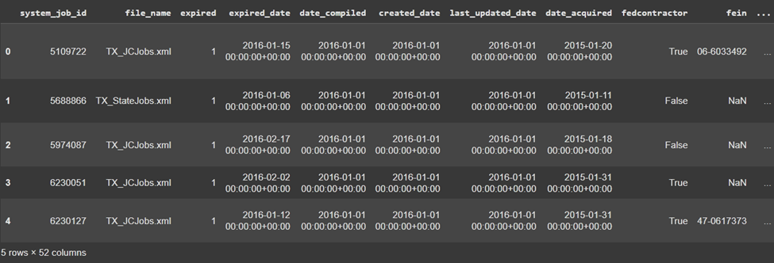
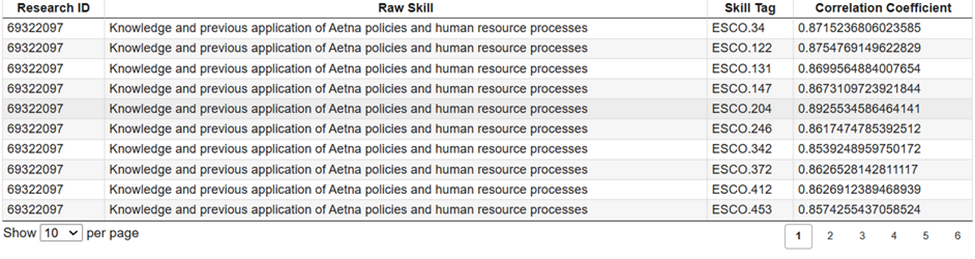

**Leveraging Artificial Intelligence for Skill Extraction & Research (LAiSER)**

**Abstract**

LAiSER is a tool designed to help learners, educators, and employers share trusted and mutually intelligible information about skills. This technical paper provides an overview of the LAiSER codebase, explaining its inputs, functions, and outputs in an easy-to-understand context. It also includes a detailed walkthrough of an example that illustrates the functionalities of the project.

**Introduction**

In today’s rapidly evolving job market, identifying and aligning skills between job descriptions and existing taxonomies is crucial. LAiSER addresses this need by leveraging artificial intelligence to extract skills from textual data and align them with a predefined skill taxonomy.

**Overview of the Project**

LAiSER consists of several modules:

- params.py: Defines global constants and parameters used across the project.
- llm_methods.py: Contains methods for interacting with language models to extract skills.
- skill_extractor.py: Implements the Skill_Extractor class to extract and align skills.
- Jupyter Notebook (Extract Function Colab Execution.ipynb): Provides a hands-on environment to run the skill extraction process.

**Inputs**

**Required Inputs**

- **Text Data**: A Pandas DataFrame containing one or more textual descriptions (e.g., job advertisements, course descriptions) from which skills are to be extracted.
- **Skill Taxonomy**: A CSV file (combined.csv) containing predefined skills against which extracted skills are aligned.
- **Pre-trained Models**: Access to language models, such as Hugging Face models, for natural language processing tasks.

**Configuration Parameters (params.py)**

- ROOT_DIR: The root directory of the project.
- INPUT_PATH and OUTPUT_PATH: Directories for input data and output results.
- SIMILARITY_THRESHOLD: Threshold for determining similarity between extracted skills and the taxonomy.
- HF_API_KEY: API key for accessing Hugging Face models.
- AI_MODEL_ID: Identifier for the specific language model used.

**Functions and Modules**

**1\. params.py**

Defines global constants and paths used throughout the project.

**2\. llm_methods.py**

Provides methods to interact with language models:

- get_completion(query, model, tokenizer): Generates skill extraction prompts and retrieves model responses for a single input.
- get_completion_batch(queries, model, tokenizer, batch_size): Processes multiple inputs in batches for efficiency.
- fetch_model_output(response): Parses the model’s raw output to extract skills.

**3\. skill_extractor.py**

Implements the Skill_Extractor class:

- **Initialization**: Loads necessary models and data, including the language model and skill taxonomy.
- extract_raw(input_text): Extracts raw skills from input text using the language model.
- align_skills(raw_skills, document_id): Aligns extracted skills with the predefined taxonomy using cosine similarity.
- extractor (data, id_column, text_column): Orchestrates the extraction and alignment process for a dataset.

**4\. Jupyter Notebook (Extract Function Colab Execution.ipynb)**

Provides an interactive environment to execute the skill extraction process step-by-step.

**Outputs**

- **Extracted Skills**: A list of skills extracted from the input text.
- **Aligned Skills**: A DataFrame containing:
- Research ID: Identifier for the input text.
- Skill Name: Raw extracted skill.
- Skill Tag: Corresponding skill from the taxonomy.
- Correlation Coefficient: Similarity score between the extracted skill and taxonomy skill.
- **Logs and Metrics**: Information on the processing steps, including any errors or warnings.

**Example Walkthrough**

**Step 1: Setup and Installation**

Ensure you have Python 3.12 installed and clone the LAiSER repository:

git clone <https://github.com/LAiSER-Software/extract-module.git>

Install the required dependencies:

pip install -r requirements.txt

**Step 2: Prepare Input Data**

Sample datasets for job descriptions and course descriptions can be downloaded from LAiSER datasets repo: <https://github.com/LAiSER-Software/datasets>. For this example we’ll use a sample dataset from LinkedIn with 36 Job Descriptions \[[Link to Dataset](https://raw.githubusercontent.com/LAiSER-Software/datasets/refs/heads/master/jobs-data/linkedin_jobs_sample_36rows.csv)\]

<!--  -->

**Load the data into a Pandas DataFrame:**

import pandas as pd

data = pd.read_csv('input_data.csv')

**Step 3: Initialize the Skill Extractor**

from skill_extractor import Skill_Extractor

skill_extractor = Skill_Extractor()

**Step 4: Extract and Align Skills**

Use the extractor method to process the data:

results = skill_extractor.extractor(data, id_column='Research ID', text_column='Text')

**Step 5: View the Results**

print(results)

**Sample Output:**

<!--  -->

**Detailed Explanation**

**Extraction Process**

1. **Text Preprocessing**: The input text is cleaned and prepared for processing.
2. **Model Prompting**: Each text input is used to generate a prompt for the language model.
3. **Skill Extraction**: The language model returns a list of skills present in the text.

**Alignment Process**

1. **Embedding Generation**: Embeddings for the extracted skills and taxonomy skills are generated using a language model.
2. **Similarity Calculation**: Cosine similarity between extracted skills and taxonomy skills is calculated.
3. **Threshold Filtering**: Matches above the

SIMILARITY_THRESHOLD

are considered valid alignments.

1. **Result Compilation**: The aligned skills and their corresponding scores are compiled into a DataFrame.

**Conclusion**

LAiSER provides an efficient way to extract and align skills from textual data using advanced language models. By automating the extraction and alignment process, it facilitates better understanding and communication of skill requirements between learners, educators, and employers.

**References**

- **Project Repository**: [LAiSER GitHub](https://github.com/Micah-Sanders/LAiSER)
- **Hugging Face Models**: [Hugging Face Model Hub](https://huggingface.co/models)
- **Spacy NLP**: [Spacy Documentation](https://spacy.io/usage)

**Acknowledgments**

This project is developed by the George Washington University Institute of Public Policy in collaboration with the Program on Skills, Credentials, and Workforce Policy.